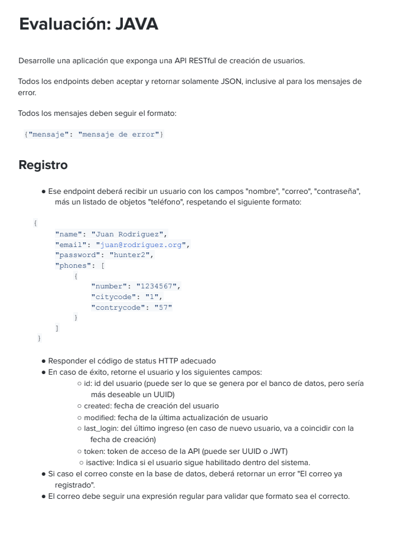
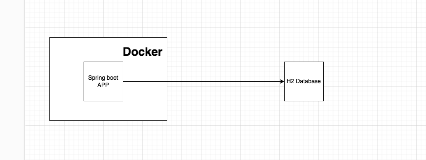
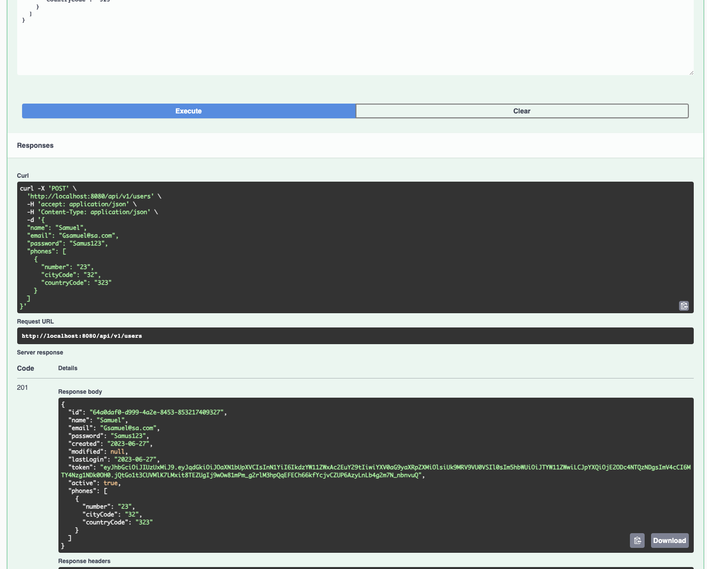
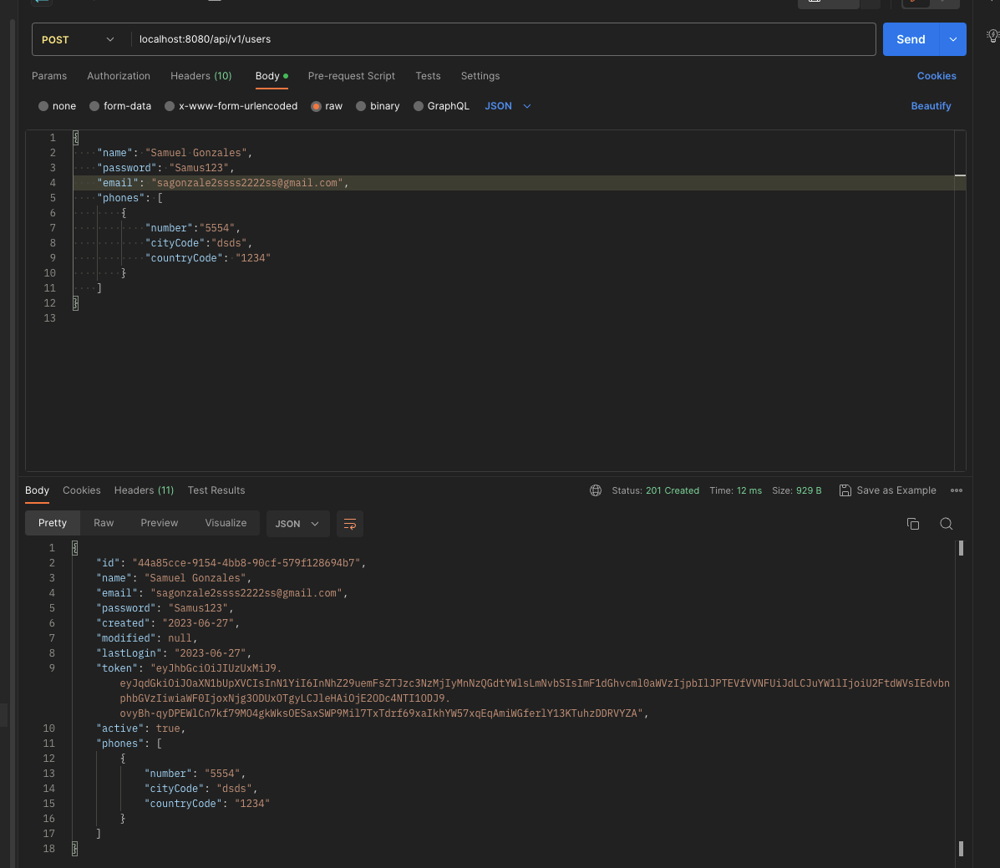
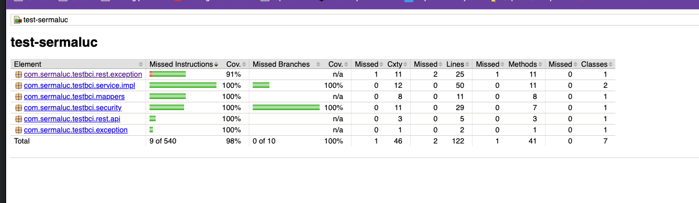

# Mi solución para el Test de [Sermaluc](https://www.nisum.com/es/inicio) 💪

### Indice

- [Descripción](#descripción)

- [Features](#features)

- [Todo](#todo)

- [Technologies & Tools](#-technologies--tools)

- [Run on local](#run-on-local)

- [Test evidences](#test-evidences)

- [Authors](#authors)

---------------------------------------------------------------------------------------------------------------------------------------------------------------------------------

## Descripción

Desarrolle una aplicación que exponga una API RESTful de creación de usuarios.

## Features

✅ `Feature 1:` Creación de usuario

## Todo

☑️ `Feature 1:` Login

☑️ `Feature 2:` Secured List Users

☑️ `Feature 3:` Add docker support

---------------------------------------------------------------------------------------------------------------------------------------------------------------------------------

## 🛠 Technologies & Tools

- **Language:** Java 17
- **Framework :** Spring Boot 3
- **Web framework :** Spring Rest
- **Data framework :** Spring Data JPA
- **Database :** H2
- **Api Docs :** Spring Doc

---------------------------------------------------------------------------------------------------------------------------------------------------------------------------------

## Run on local

1. Clonar el repo
2. Instalar java 17 (con SDK Man o desde instalador)
3. Dentro del repo en la consola ejecutar `./gradlew test` para correr los unit test del proyecto (macos / linux) / `gradlew.bat test` (windows)
4. Dentro del repo en la consola ejecutar `./gradlew spring-boot:run` para iniciar la APP / `gradlew.bat spring-boot:run` (windows). El proyecto corre por defecto en el puerto 8080.
5. Usar la colección de Postman para probar [Postman collection](readme-files/Nisum.postman_collection.json) dentro de el esta el endpoint para probar y los ejemplos para probar los casos de excepción.
6. Asimismo se puede acceder al swagger-ui [Swagger UI](http://localhost:8080/swagger-doc/swagger-ui/index.html)

## Test evidences

-------------------------------------------------------------------------------------------------------------------------------------------------------------------------

## Authors

| [ Samuel Gonzales](https://github.com/samusfree) |  
|:---------------------------------------------------------------------------------------------------------------------------------------:|
